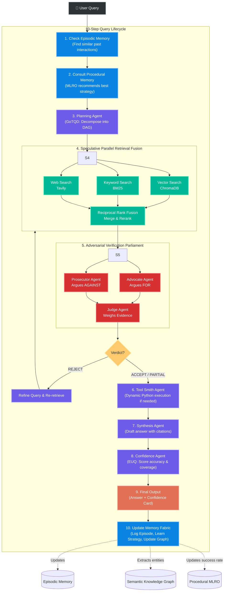

# NEXUS — Neuro-Episodic Expert Unified System

> A Multi-Agent Agentic RAG System 

## 🚀 Quick Start

### 1. Install Dependencies
```bash
conda activate pytorch
pip install -r requirements.txt
```

### 2. Configure API Keys
Edit `.env` with your API keys:
```
GROQ_API_KEY=gsk_your-key-here
TAVILY_API_KEY=tvly-your-key-here  # Optional, for web search
```
Get a free Groq key at [console.groq.com](https://console.groq.com)

### 3. Run NEXUS
```bash
python -m nexus.main
```

### 4. Ingest Documents
```
NEXUS> /ingest path/to/your/document.pdf
NEXUS> /ingest path/to/your/notes.txt
```

### 5. Ask Questions
```
NEXUS> What are the key concepts in agentic RAG?
```

---

## 🧠 The 7 Unique Concepts

| # | Concept | What It Does | File |
|---|---------|-------------|------|
| 1 | **Cognitive Memory Fabric (CMF)** | 3-tier memory: episodic + semantic + procedural | `memory.py` |
| 2 | **Adversarial Verification Parliament (AVP)** | 3 agents debate document quality before answering | `agents.py` |
| 3 | **Speculative Parallel Retrieval + Fusion (SPRF)** | Vector + Keyword + Web retrieval fused via RRF | `agents.py` |
| 4 | **Graph-of-Thought Query Decomposition (GoTQD)** | Complex queries become parallel sub-query DAGs | `agents.py` |
| 5 | **Meta-Learning Retrieval Optimizer (MLRO)** | System learns best strategies over time | `memory.py` |
| 6 | **Epistemic Uncertainty Quantification (EUQ)** | Multi-dimensional confidence scoring with flags | `agents.py` |
| 7 | **Self-Evolving Tool Synthesis (SETS)** | Dynamic Python tool generation for computation | `agents.py` |

---

## 📁 Project Structure

```
nexus/
├── __init__.py    # Package marker
├── config.py      # Configuration, LLM client (Groq), embeddings, CLI formatters
├── memory.py      # Episodic + Semantic (knowledge graph) + Procedural memory + Consolidator
├── agents.py      # All 11 agents: planner, 3 retrievers, RRF fusion, parliament, synthesis, confidence, tool smith
├── core.py        # Message bus + Orchestrator (coordinates the 10-step pipeline)
└── main.py        # CLI entry point, document ingestion, user feedback loop
```

---

## 🏗️ System Architecture & Data Flow



---

## ⚙️ 10-Step Query Pipeline

```
1. Check Memory        → Find similar past queries in episodic memory
2. Get Strategy        → Procedural memory recommends best approach (MLRO)
3. Plan Sub-queries    → GoTQD decomposes complex queries into a DAG
4. Parallel Retrieval  → Vector (ChromaDB) + Keyword (BM25) + Web (Tavily) → RRF Fusion
5. Verification        → Advocate argues FOR, Prosecutor argues AGAINST, Judge renders verdict
6. Tool Smith          → Generate computation tools if needed (SETS)
7. Synthesize Answer   → Generate cited answer from verified sources
8. Confidence Scoring  → 4-dimensional scoring: accuracy, agreement, recency, coverage (EUQ)
9. Display Results     → Rich formatted answer + confidence card + source table
10. Update Memory      → Record episode, update knowledge graph, learn strategy outcomes
```

---

## 🔧 CLI Commands

| Command | Description |
|---------|-------------|
| `/ingest <file>` | Add documents (PDF/text) to knowledge base |
| `/stats` | View system statistics & performance matrix |
| `/memory` | Check memory system status |
| `/clear` | Reset all memory |
| `/help` | Show all commands |
| `/quit` | Exit NEXUS |

---

## 📦 Tech Stack

| Library | Purpose |
|---------|---------|
| `openai` | Groq API client (OpenAI-compatible) |
| `sentence-transformers` | Local embeddings (all-MiniLM-L6-v2) |
| `chromadb` | Vector database for semantic search |
| `rank-bm25` | BM25 keyword search |
| `tavily-python` | Web search API |
| `networkx` | Knowledge graph (semantic memory) |
| `rich` | Terminal UI |
| `pypdf` | PDF ingestion |

---

## 🔑 Environment Variables

| Variable | Description | Required |
|----------|-------------|----------|
| `GROQ_API_KEY` | Groq API key (free tier) | ✅ |
| `GROQ_MODEL` | Model name (default: `llama-3.3-70b-versatile`) | ❌ |
| `TAVILY_API_KEY` | Tavily web search key | ❌ |
| `EMBEDDING_PROVIDER` | `local` (default) | ❌ |
| `MAX_RETRIEVAL_RESULTS` | Top-k results per retriever (default: 5) | ❌ |
| `CONFIDENCE_THRESHOLD` | Min confidence threshold (default: 0.6) | ❌ |
| `ENABLE_WEB_SEARCH` | Enable Tavily web search (default: true) | ❌ |
| `ENABLE_TOOL_SYNTHESIS` | Enable dynamic tool generation (default: true) | ❌ |
| `LOG_LEVEL` | Logging level (default: INFO) | ❌ |
