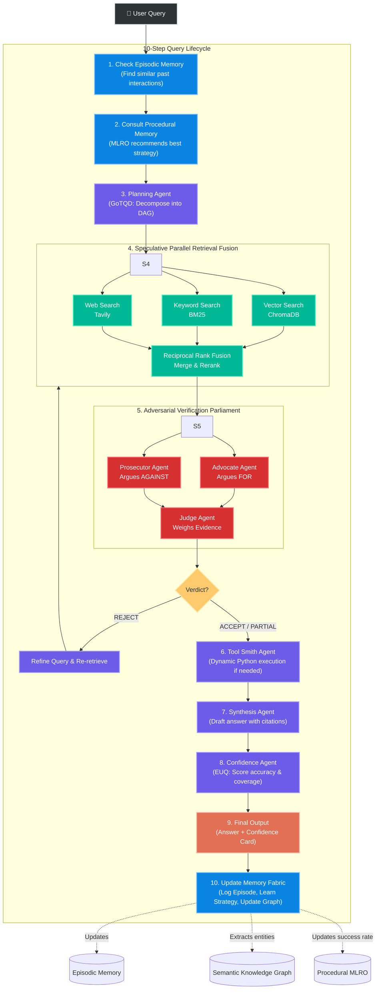

# NEXUS: Architecture & Data Flow

Below is the complete architectural graph of the NEXUS multi-agent system. It shows how a user query moves through the 10-step pipeline, interacts with the three-tier Cognitive Memory Fabric, and passes through the Adversarial Verification Parliament.

